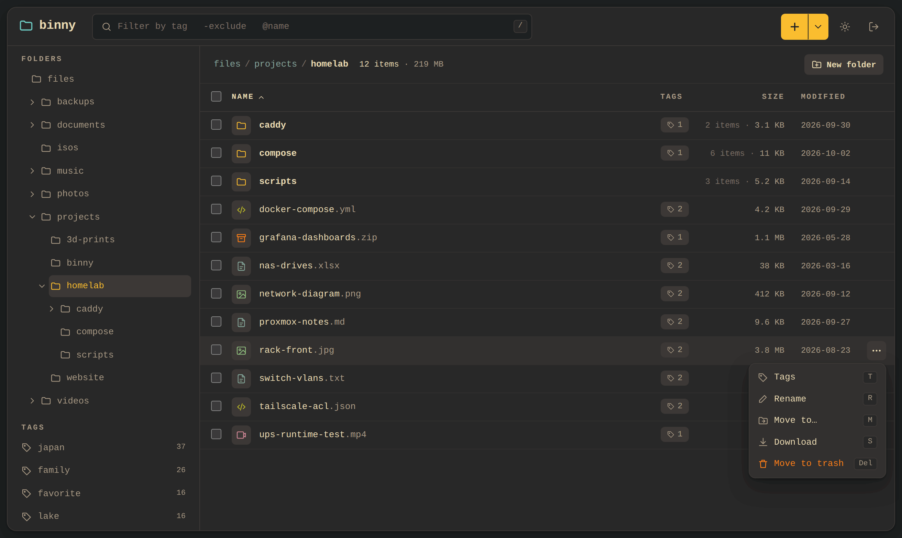
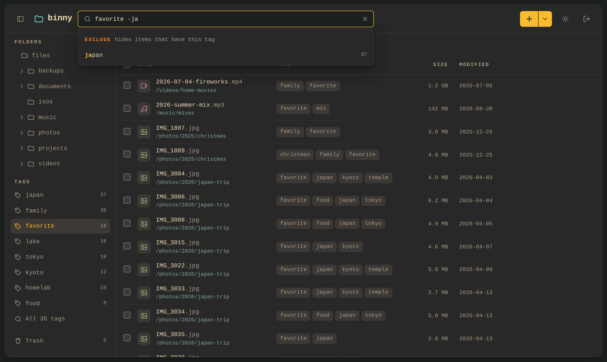
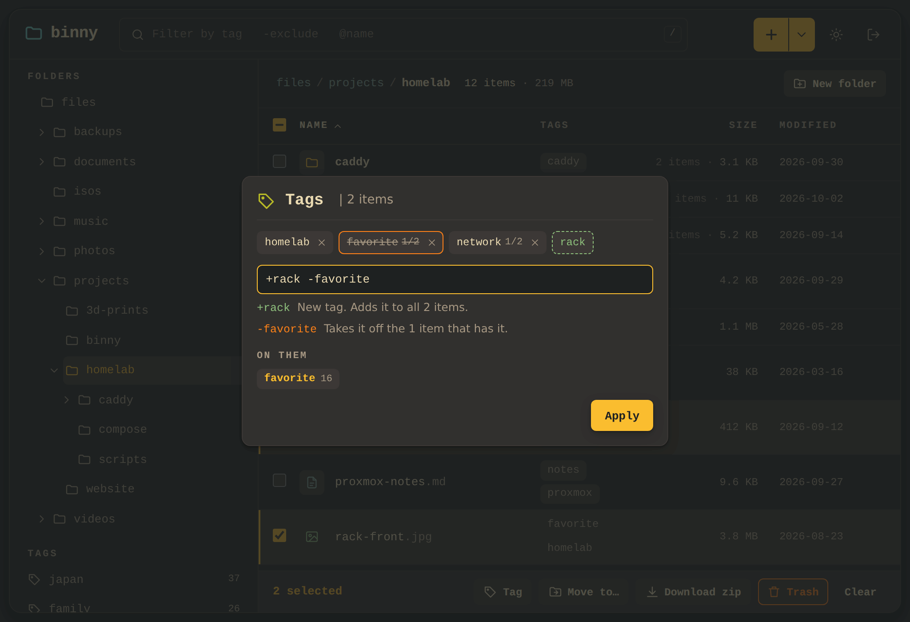
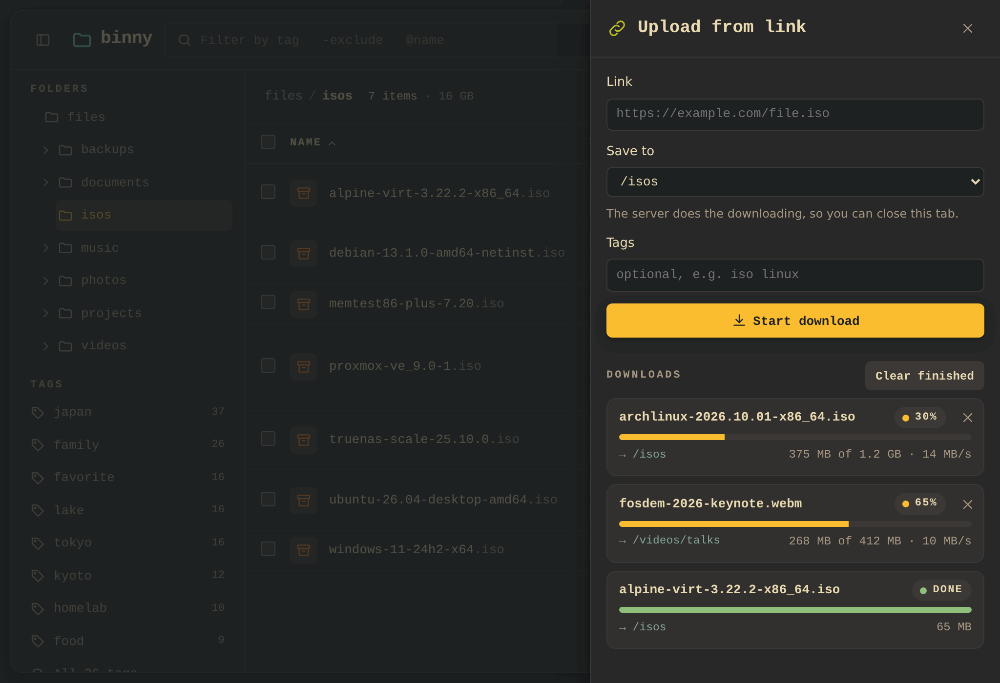
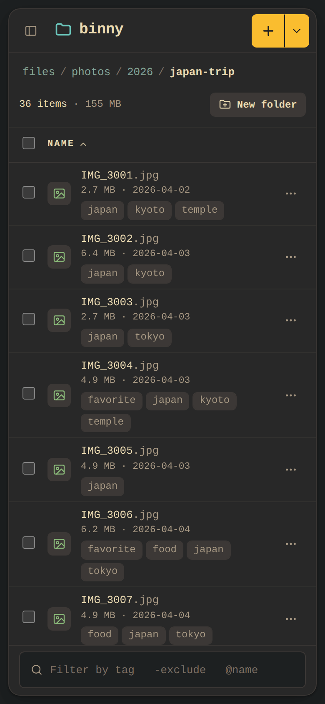
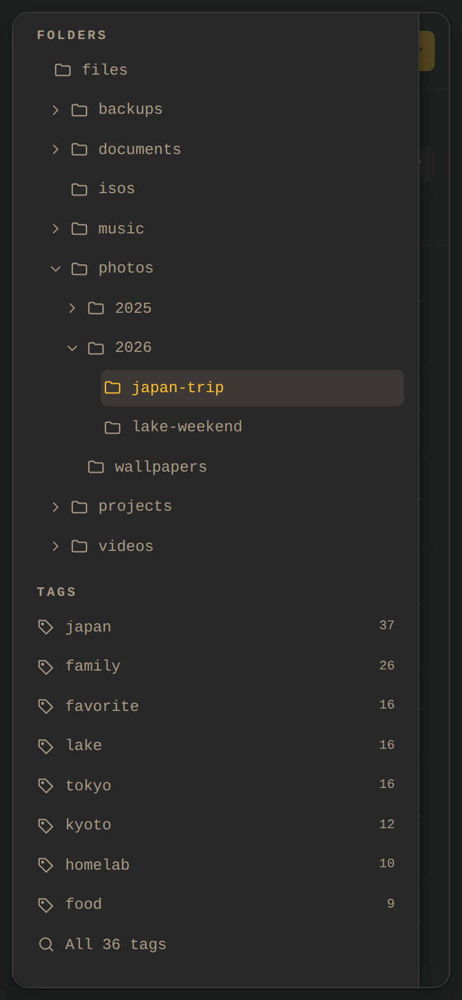
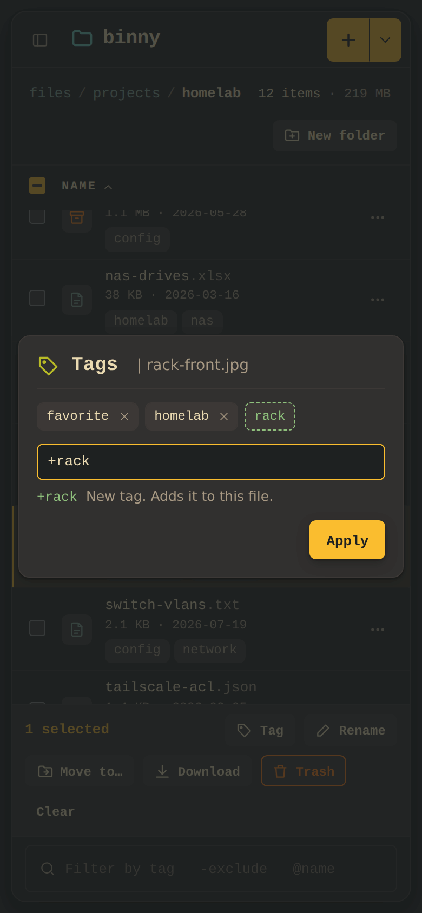

<p align="center">
  
</p>

<h1 align="center">Binny</h1>

<p align="center">
  A small file host for your own network 🗂️
</p>

Binny is a file explorer in the browser for one person's files: folders, uploads and downloads,
tags you can search by, a trash, and upload from link, where the server fetches a file for you.
Your files stay ordinary files in a folder that any file manager can open, and Binny only remembers
the tags and what's in the trash.

<p align="center">
  
  
</p>

- Folder tree, breadcrumb and file list; drag and drop to upload or move, many files at once
- Tags on any file or folder, with [imgy](https://github.com/cavecomputing/imgy)'s tag syntax
  (`tag`, `-tag`, `+new`, `@name`, `old>new`)
- Search everything by tag or name
- Upload from link: paste a URL and the server downloads it into a folder, even after the tab closes
- Download a file, or a folder or a selection as a zip
- Trash with restore; nothing is gone until you empty it
- One password, remembered per device; dark and light themes, and a phone layout

<p align="center">
  
  
</p>

## Quick start

All you need is Git and [uv](https://docs.astral.sh/uv/).

```bash
git clone https://github.com/cavecomputing/binny.git
cd binny
uv sync
BINNY_PASSWORD=pick-one uv run app.py
```

Then open <http://localhost:5000> and sign in with that password.

To run Binny with Docker instead, put the password in `docker/.env`:

```bash
echo 'BINNY_PASSWORD=pick-one' > docker/.env
docker compose -f docker/compose.yml up --build -d
```

The container listens on `127.0.0.1:5000`, keeps everything in `data/`, and runs as UID/GID 1000
unless `PUID` and `PGID` (also in `docker/.env`) say otherwise. Binny has no HTTPS of its own: put
Caddy in front of it (`reverse_proxy 127.0.0.1:5000`) and keep it on your LAN or tailnet.

## Updating

Back up `data/`, stop Binny, then run:

```bash
git pull
uv sync
```

and start it again with the same password. With Docker, run `git pull`, then the same
`docker compose` command as above, which rebuilds and restarts it. Restarting cuts short any
upload from link still in progress, so let those finish first.

## On your phone

Binny fits a phone: the folder tree and tags move into a drawer, along with the theme switch and
sign-out, and each file's size, date and tags sit under its name.

<p align="center">
  
  
  
</p>

Open Binny on your phone at the address Caddy serves it on. To try it on your network without
Caddy, let it listen on every address:

```bash
BINNY_PASSWORD=pick-one uv run app.py --host 0.0.0.0
```

Then open `http://<computer's LAN address>:5000` on a phone on the same network. Only do this on a
network you trust: over plain HTTP, the password crosses it unencrypted.

## Your data

```
data/
├── files/       # your files and folders, as they are
│   └── .trash/  # trashed items, until you empty the trash
└── binny.db     # tags, the trash's records, the cookie signing key
```

The folder is the source of truth: files you copy into `data/files/` show up when you open their
folder. Back up `data/` and you've backed up everything. Changing `BINNY_PASSWORD` signs every
device out.

See [CLAUDE.md](CLAUDE.md) for how it works and the conventions for changing it.
